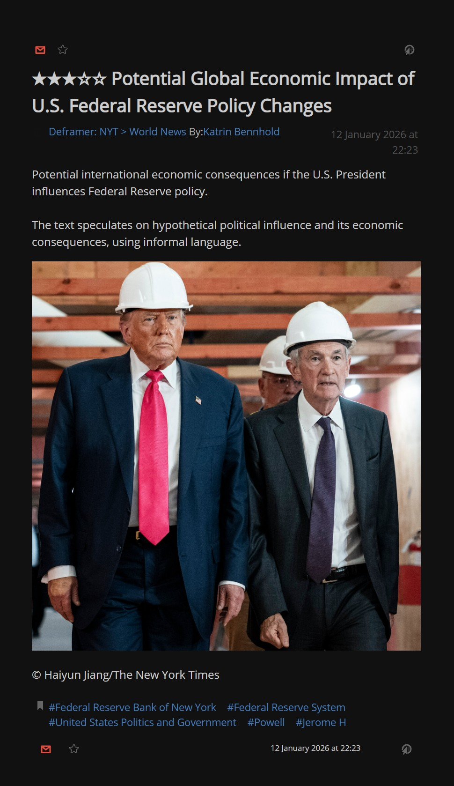

# Example

This is a sample taken from `https://rss.nytimes.com/services/xml/rss/nyt/World.xml`

AI does reasoning and replacement.

```xml
<item>
    <title>★★★☆☆ Potential Global Economic Impact of U.S. Federal Reserve Policy Changes</title>
    <link>https://www.nytimes.com/2026/01/12/world/federal-reserve-global-costs-iran-gaza.html</link>
    <description>Potential international economic consequences if the U.S. President influences Federal Reserve policy.<br/><br/>The text speculates on hypothetical political influence and its economic consequences, using informal language.</description>
    <pubDate>Mon, 12 Jan 2026 21:23:10 +0000</pubDate>
    <guid>https://www.nytimes.com/2026/01/12/world/federal-reserve-global-costs-iran-gaza.html</guid>
    <category>Federal Reserve Bank of New York</category>
    <category>Federal Reserve System</category>
    <category>United States Politics and Government</category>
    <category>Powell, Jerome H</category>
    <atom:link href="https://www.nytimes.com/2026/01/12/world/federal-reserve-global-costs-iran-gaza.html" rel="standout"/>
    <dc:creator>Katrin Bennhold</dc:creator>
    <deframer:clickbait>0.3</deframer:clickbait>
    <deframer:clickbait_reason>Uses a slightly informal verb to create mild curiosity.</deframer:clickbait_reason>
    <deframer:description_corrected>Potential international economic consequences if the U.S. President influences Federal Reserve policy.</deframer:description_corrected>
    <deframer:description_correction_reason>Condensed information, removed specific mention of President Trump for neutrality.</deframer:description_correction_reason>
    <deframer:description_original>If President Trump succeeds in gaining control of the Federal Reserve, it could have ripple effects beyond U.S. borders.</deframer:description_original>
    <deframer:framing>0.6</deframer:framing>
    <deframer:framing_reason>Implies negative consequences and political interference.</deframer:framing_reason>
    <deframer:hyper_stimulus_reason>No excessive capitalization, punctuation, or emotional language.</deframer:hyper_stimulus_reason>
    <deframer:overall_reason>The text speculates on hypothetical political influence and its economic consequences, using informal language.</deframer:overall_reason>
    <deframer:persuasive_reason>No direct call to action or sales language.</deframer:persuasive_reason>
    <deframer:speculative_content>0.7</deframer:speculative_content>
    <deframer:speculative_reason>Discusses hypothetical future events and their 'ripple effects'.</deframer:speculative_reason>
    <deframer:title_corrected>Potential Global Economic Impact of U.S. Federal Reserve Policy Changes</deframer:title_corrected>
    <deframer:title_correction_reason>Replaced informal verb 'futzing' with neutral term 'policy changes'.</deframer:title_correction_reason>
    <deframer:title_original>The Global Cost of Futzing With the Fed</deframer:title_original>
    <media:content height="1800" medium="image" url="https://static01.nyt.com/images/2025/07/25/multimedia/13int-theworld-fed-powell-promo/13int-theworld-fed-powell-promo-mediumSquareAt3X.jpg" width="1800"/>
    <media:credit>Haiyun Jiang/The New York Times</media:credit>
</item>
```

## Screenshots

The deframer makes every article to be more neutral and always sounds like "the news".




