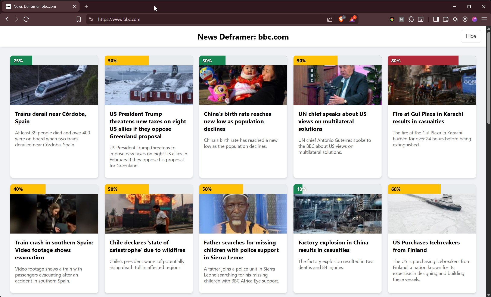
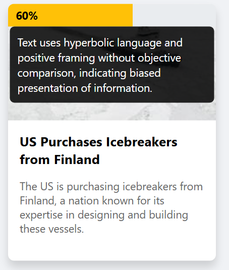
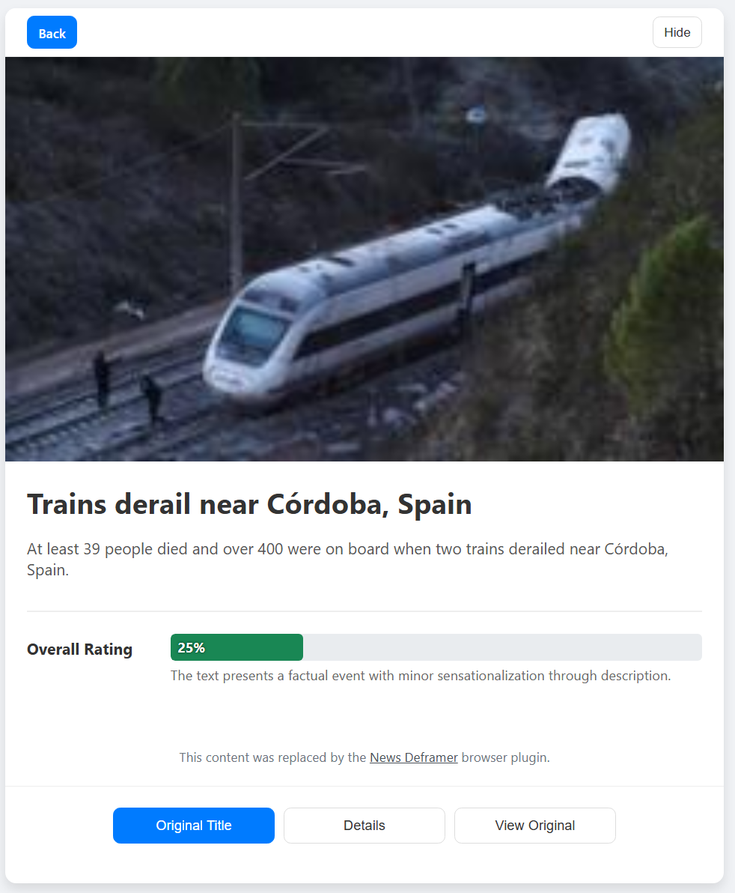
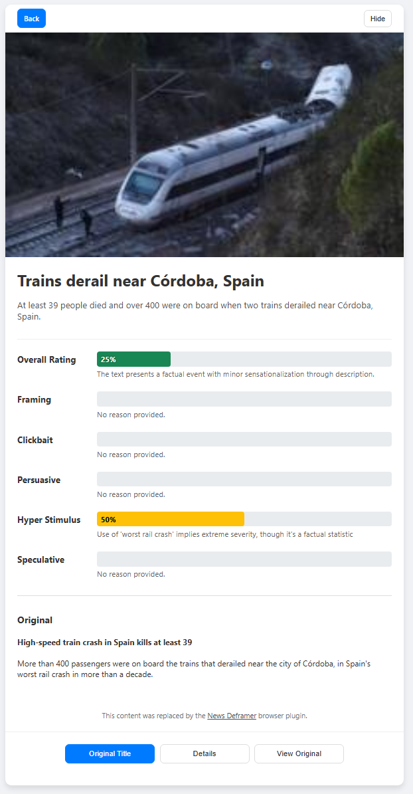
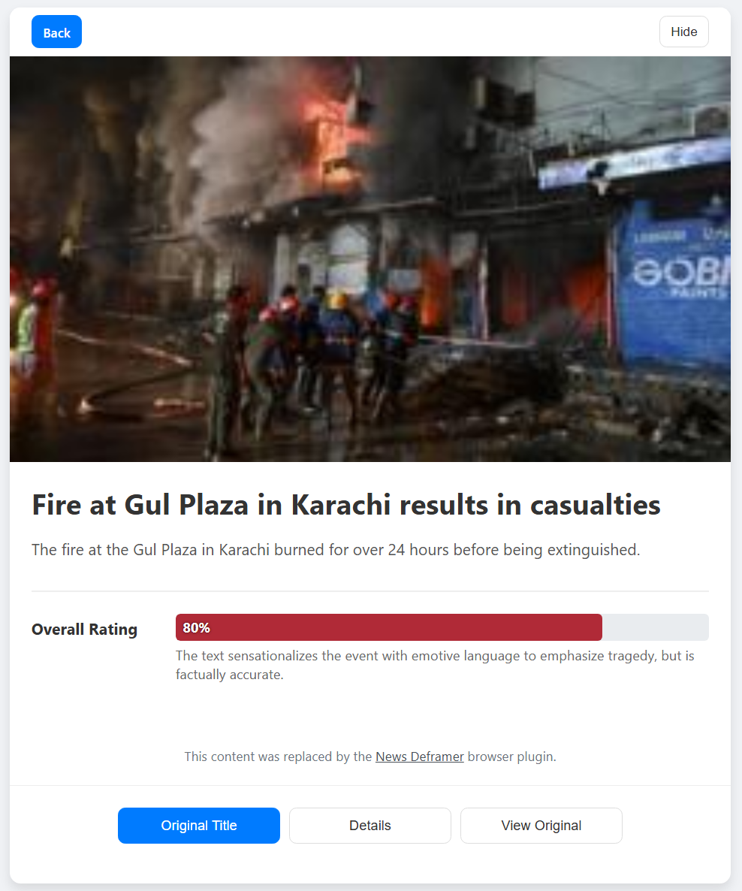
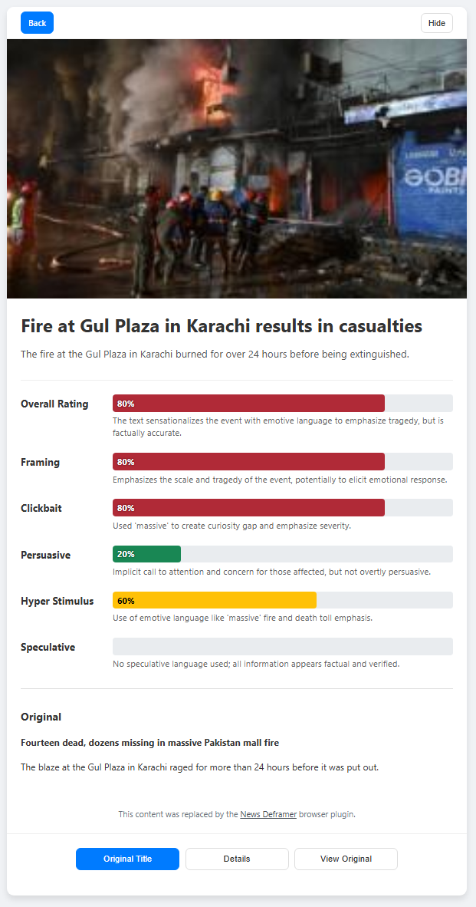
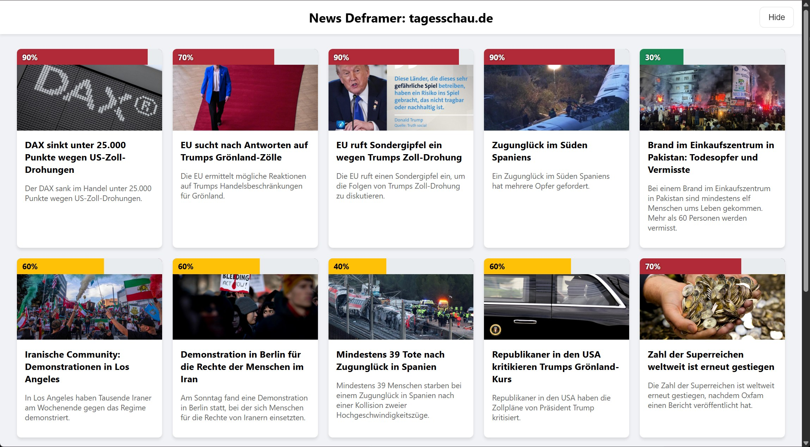
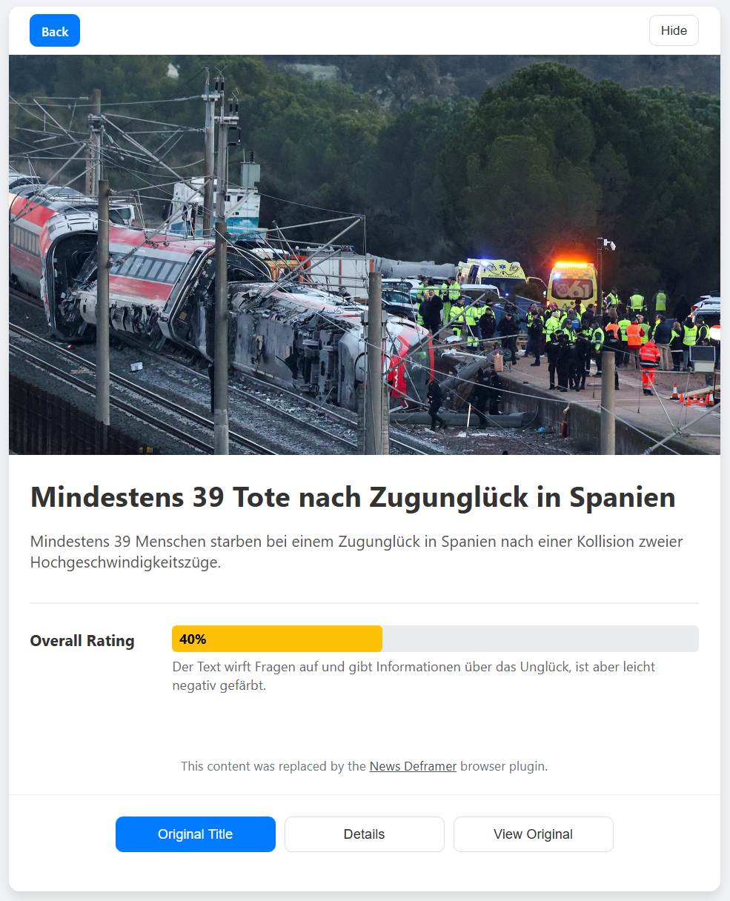
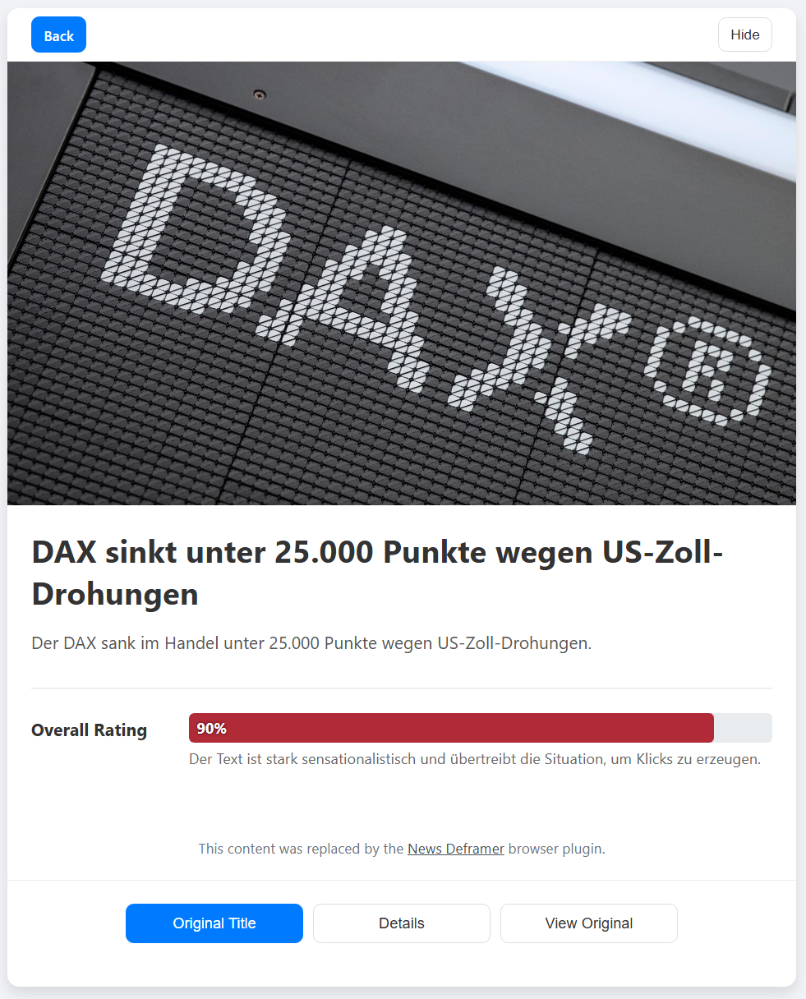
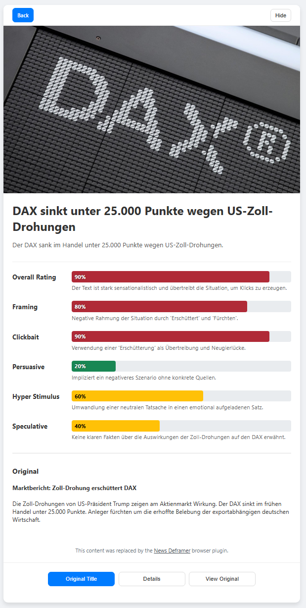

# Web Browser Plugin Showcase

## AI Configuration

The following setup was used to generate these examples:

- **Hardware**: Mac Mini M1 (16GB RAM), running macOS Tahoe 26.2
- **Software**: [LM Studio](https://lmstudio.ai/) 0.3.39
- **Model**: [meta-llama-3.1-8b-instruct](https://huggingface.co/lmstudio-community/Meta-Llama-3.1-8B-Instruct-GGUF)

The system utilizes these [Prompts](../../pkg/think/prompts/).

**Quote:** *"You are a strictly objective, neutral media analyst and news editor. Your task is to analyze texts (title and description) for journalistic quality, bias, and sensationalism, and to create a neutral version. You must provide specific, concise reasons for every assessment and correction, culminating in an overall summary. [...]"*

This prompt directs the AI to maintain strict objectivity and political neutrality.

*Note: While the LLM performance on the M1 chip is modest (approx. 26s per request), it provides a cost-effective and efficient local solution.*

```txt
level=DEBUG msg="openai request duration" duration=26.833331235s
level=DEBUG msg="openai token usage" prompt_tokens=1470 completion_tokens=303 thoughts_tokens=0 total_tokens=1773
```

## Examples

### BBC

- RSS feed `https://feeds.bbci.co.uk/news/world/rss.xml`

**Portal**

The plugin overlays the original web page to provide a distraction-free environment.

**Key Features:**
- **Neutralized Content**: You will not see the original, potentially emotionally charged titles or descriptions. Instead, the AI generates neutral summaries designed to inform rather than provoke.
- **Sensationalism Score**: The percentage indicator reveals the level of detected sensationalism or bias. A red indicator suggests high levels of manipulation, framing, bias, or misinformation.

**Recommendation**: A score of 50% or higher suggests significant bias. We recommend seeking alternative sources for a more balanced perspective.



**Quick Insights**: Hovering over the percentage bar reveals the detailed analysis from the News Deframer. This often provides enough context to skip the full article.



**Article**

You retain full control over your reading experience. The plugin intercepts navigation to article URLs. Regardless of whether you access the article via the portal or a direct link, News Deframer always presents the analysis preview first to protect you.

**Important Note**: The plugin currently analyzes only the RSS feed metadata (title and description). The body of the article remains untouched. Future updates may include full-text AI analysis triggered via human trusted flaggers.

- **"Hide" Button**: Dismisses the Deframer overlay to reveal the original article on the publisher's site.
- **Protected Viewing**: By default, the original title and description are hidden to reduce emotional impact. You can choose to expand the view to see the AI's reasoning and the original text.

Article 1

| Basic | Expanded |
| :---: | :---: |
|  |  |

Article 2

| Basic | Expanded |
| :---: | :---: |
|  |  |

### Tagesschau (German)

- RSS feed `https://www.tagesschau.de/index~rss2.xml`

**Portal**



**Article**

Article 1

| Basic | Expanded |
| :---: | :---: |
|  |  |

Article 2

| Basic | Expanded |
| :---: | :---: |
|  |  |